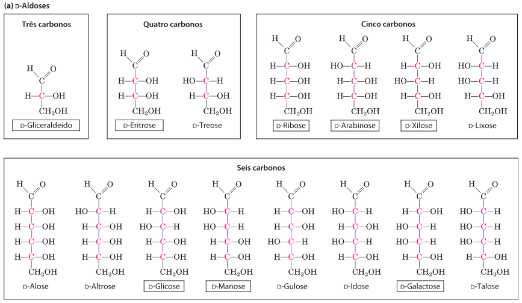

```{r setup, include=FALSE}
knitr::opts_chunk$set(
  echo = FALSE, warning = FALSE, message = FALSE,
  fig.width = 7, fig.height = 2.5, 
  fig.align='center'
)
options(htmltools.dir.version = TRUE)
```

```{r xaringan-tile-view, echo=FALSE}
xaringanExtra::use_tile_view()
```

```{r xaringan-scribble, echo=FALSE}
xaringanExtra::use_scribble()
```

```{r xaringan-panelset, echo=FALSE}
xaringanExtra::use_panelset()
```

## Definição

<br />

.pull-left[
Polihidroxialdeídos ou polihidroxicetonas. 


Originados da fotossíntese.

<br />

```{r, out.width=300, fig.align='center'}
knitr::include_graphics("https://pt-static.z-dn.net/files/ddc/c5bde963ac241c2d24e0bbe6fd2f4ff1.jpg")

knitr::include_graphics("https://www.infoescola.com/wp-content/uploads/2010/07/propanal.jpg")
```

]

.pull-right[
```{r, out.height=500, out.width=500}
knitr::include_graphics("https://images.unsplash.com/photo-1497250681960-ef046c08a56e?ixid=MXwxMjA3fDB8MHxwaG90by1wYWdlfHx8fGVufDB8fHw%3D&ixlib=rb-1.2.1&auto=format&fit=crop&w=634&q=80")
```

]

---

## Função

.panelset[
.panel[.panel-name[Estrutural]
Ex.: parede celular de plantas e bactérias e tecidos conectivos animais

```{r, out.height=400, fig.align='center'}
knitr::include_graphics("https://media4.giphy.com/media/gsy6H7AvrIoYE/giphy.gif?cid=ecf05e47f2qf2cip017xcq0vwf96v327jn0jz9dxjojq54zs&rid=giphy.gif")
```
]

.panel[.panel-name[Reserva]
Ex.: Amido e glicogênio.

```{r out.width=400}
knitr::include_graphics("https://4.bp.blogspot.com/-a4NE_GVKxcQ/V9oq_u8tviI/AAAAAAAAB3o/Gl6YtOQpxWE_nahw44ccmoNGSkbcIiOhACLcB/s1600/Glicogenina.jpg")
```
]

.panel[.panel-name[Reconhecimento e adesão]
Ex.: glicosaminoglicanos da MEC

```{r, out.height=400, fig.align='center'}
knitr::include_graphics("https://cdn.kastatic.org/ka-perseus-images/2c6cd5a850caf5531ed24d9d4e4e004b4d39a17e.png")
```
]

.panel[.panel-name[Sinalização]
Ex.: glicoconjugados

```{r, out.height=400, fig.align='center'}
knitr::include_graphics("https://www.researchgate.net/profile/A_Murphy4/post/Recombinant-Protein-Expression-Host-Choice-and-Raising-Antibodies-Against-the-Protein-Simplification-of-the-Approach/attachment/59d626e86cda7b8083a23d10/AS%3A519570226991104%401500886603537/image/Glycosylated+Protein.png")
```

]
]

---

```{r out.width=700}
knitr::include_graphics("https://i.pinimg.com/originals/9d/81/f5/9d81f53dd8d3caab2d2e22803db95be2.jpg")
```

---

## Classificação geral

<br />

1. Monossacarídeos: 1 monômero

2. Oligossacarídeos: 2 a 10 monômeros

3. Polissacarídeos: 11+ monômeros

---

## Monossacarídeos: classificação quanto ao número de C

- Trioses (3C): intermediários metabólicos

```{r, out.width=500, fig.align='center'}
knitr::include_graphics("https://chem.libretexts.org/@api/deki/files/60997/triose.png?revision=1")
```

- Pentoses (5C) e hexoses (6C): estruturas cíclicas.

```{r, out.width=500, fig.align='center'}
knitr::include_graphics("https://1.bp.blogspot.com/-h1xrfdz3wU8/VtXzZSMZcAI/AAAAAAAABbo/8HKpajnt1Zw/s1600/456471.image0.jpg")
```

.footnote[*Monossacarídeos pouco comuns: 4C: tetroses; 7C: heptoses.]

---

## Monossacarídeos: classificação quanto à posição da carbonila

- Aldose: carbonila formando aldeíd**o**

- Cetose: carbonila formando cet**o**na

```{r}

```

---

## Estereoisomeria de monossacarídeos

<br />
Monossacarídeos têm um ou mais carbonos assimétricos (quirais) -> 
estereoisômeros

.pull-left[
<br />
.brand-charcoal[.font130[**Classificação segundo Fischer:**]]


**Passo 1:** Identificar centro quiral **mais distante** da carbonila.

**Passo 2:** Identificar posição da hidroxila.

Hidroxila à direita? Isômero D.

Hidroxila à esquerda? Isômero L.

<br />
Hexoses são D em sua maioria.

]

.pull-right[
```{r out.width=400}


```
]

---

## Estereoisomeria de monossacarídeos

<br />
Monossacarídeos têm um ou mais carbonos assimétricos (quirais) -> 
estereoisômeros

.pull-left[
<br />
.brand-charcoal[.font130[**Classificação segundo Fischer:**]]


**Passo 1:** Identificar centro quiral **mais distante** da carbonila.

**Passo 2:** Identificar posição da hidroxila.

Hidroxila à direita? Isômero D.

Hidroxila à esquerda? Isômero L.

<br />
Hexoses são D em sua maioria.

]

.pull-right[
```{r out.width=300}


```
]

---

## Estruturas de monossacarídeos

<br />
```{r, out.width=900}

```

---

## Estruturas de monossacarídeos

<br />

```{r, out.width=800}

```

---

## Estruturas de monossacarídeos

```{r, out.width=400}

```

---

## Estruturas cíclicas de monossacarídeos

<br />

Aldeído + álcool = hemiacetal

Cetona + álcool = hemicetal

```{r out.width=800}

```

---

## Estruturas cíclicas de monossacarídeos

<br />

Carbono da carbonila envolvida na reação é chamado **carbono anomérico**

```{r, out.width=350}

```

---

## Formas anoméricas $\alpha$ e $\beta$

<br />

Dependem da posição em que a hidroxila "ataca" o carbono da carbonila.

```{r}

```

---

## Formas anoméricas $\alpha$ e $\beta$

<br />

Dependem da posição em que a hidroxila "ataca" o carbono da carbonila. 

Como as reações são reversíveis, ocorre **mutarrotação**.

```{r, out.width=800}

```

---

## Piranoses e furanoses

.pull-left[
Piranose: anel com 6 átomos

Furanose: anel com 5 átomos
]

.pull-right[
```{r, out.width=400}

```
]

---

## Dissacarídeos

<br />

Dois monômeros de monossacarídeos unidos por **ligação *O*-glicosídica**.

Reação de condensação: hidroxila de um açúcar reage com carbonil de outro, liberando água.

```{r out.width=500}

```

---

background-image: url(figs/dissacarideos.png)
background-position: 85% 50%
background-size: 350px

## Dissacarídeos

<br />

.pull-left[
Acúcares podem ser **açúcares redutores** se tiverem o carbono anomérico livre: oxidação do carbono anomérico.

Extremidade com carbono anomérico livre é chamada **extremidade redutora**.

Se carbono anomérico não estiver livre, o açúcar é **não-redutor**.
]

---

## A ligação *N*-glicosídica

<br />

Carbono anomérico de um açúcar pode se ligar a **nitrogênio** de uma molécula, como ocorre em nucleotídeos.

```{r out.width=450}
knitr::include_graphics("https://upload.wikimedia.org/wikipedia/commons/thumb/e/e8/Adenosin.svg/400px-Adenosin.svg.png")
```

---

```{r out.width=800}
knitr::include_graphics("https://i.redd.it/1fczcor2tjl31.png")
```

---

## Polissacarídeos

<br />
Maioria dos carboidratos na natureza. Podem ser **homopolissacarídeos** (única espécie monomérica) ou **heteropolissacarídeos** (2+ espécies), e **ramificados** ou **não-ramificados**.

```{r out.width=500}

```

---

## Homopolissacarídeos de estocagem

.panelset[
.panel[.panel-name[Amido]
.pull-left[Formado por 2 polímeros de glicose:
- amilose: cadeia longa e não-ramificada de resíduos de D-glicose conectados 
por ligações $\alpha$ 1 &rarr; 4

- amilopectina: Polímero ramificado de D-glicose, com ligações $\alpha$ 1 &rarr; 4 e $\alpha$ 1 &rarr; 6 a cada 24-30 resíduos (ramificações)
]
.pull-right[
```{r out.width=700}

```
]
]
.panel[.panel-name[A bioquímica das ervilhas de Mendel]
.pull-left[
```{r out.width=400}

```
]
.pull-right[
```{r out.width=600}

```
]
]
.panel[.panel-name[Glicogênio]
Polímero ramificado de D-glicose, com ligações $\alpha$ 1 &rarr; 4 e $\alpha$ 1 &rarr; 6 a cada 8-12 resíduos (ramificações)

```{r out.width=800}
knitr::include_graphics("https://cdn.goconqr.com/uploads/media/image/11376405/desktop_613458ac-2381-4b43-b6d6-ee0297f51575.png")
```
]

.panel[.panel-name[Aspectos evolutivos]
<br />
.center[.brand-charcoal[.font130[**Qual é a vantagem evolutiva das ramificações no glicogênio?**]]]

.center[As enzimas que quebram o glicogênio atuam somente nas extremidades não-redutoras. Com as ramificações, diferentes enzimas conseguem atuar **simultaneamente** em diferentes cadeias.]

]

]

---

```{r out.width=600}
knitr::include_graphics("https://pics.me.me/thumb_nothing-is-made-to-be-broken-uh-glycogen-i-guess-43511550.png")
```

---

## Homopolissacarídeos estruturais

.panelset[
.panel[.panel-name[Quitina]
Polímero linear composto por ligações $\beta$ 1 &rarr; 4 entre resíduos de *N*-acetilglicosamina.

```{r out.width=600}

```
]
.panel[.panel-name[Celulose]
Polímero linear e não-ramificado formado por resíduos de D-glicose unidos por
ligações $\beta$ 1 &rarr; 4 glicosídicas.

```{r out.width=700}

```
]
.panel[.panel-name[Aspectos evolutivos]
<br />
.center[.brand-charcoal[.font130[**Por que animais vertebrados conseguem degradar amido, mas não celulose?**]]]

.center[Animais vertebrados não possuem enzimas para hidrolisar ligações 
$\beta$ 1 &rarr; 4 glicosídicas.

Genes conservados em clados como Arthropoda e Nematoda, mas perdidos na maioria dos animais vertebrados.
]
]

]

---

## Heteropolissacarídeos estruturais

.panelset[
.panel[.panel-name[Glicosaminoglicanos]
Formam a matrix extracelular (MEC) e são compostos por um ácido urônico (exceto para queratan-sulfato) e um aminoaçúcar *N*-acetilado.

```{r out.width=350}

```
]

.panel[.panel-name[Peptidoglicano]
Resíduos alternados de *N*-acetilglicosamina e ácido *N*-acetilmurâmico.

```{r out.width=350}
knitr::include_graphics("https://maestrovirtuale.com/wp-content/uploads/2019/10/Peptidoglucano.jpg")
```

]

.panel[.panel-name[Lisozimas e defesa]
Lisozimas hidrolisam ligações $\beta$ 1 &rarr; 4 glicosídicas entre resíduos de 
*N*-acetilglicosamina e ácido *N*-acetilmurâmico em peptidoglicanos de bactérias.

```{r out.width=600}
knitr::include_graphics("https://media4.giphy.com/media/DRMTy97vzZY9W/100.gif")
```
]

]

---

## Glicoconjugados

.panelset[
.panel[.panel-name[Definição]
Carboidratos covalentemente ligados a proteínas ou lipídeos.

```{r out.width=350}

```
]

.panel[.panel-name[Proteoglicanos]
Macromoléculas da superfície celular ou da MEC formadas por 1+ cadeias de
glicosaminoglicanos sulfatados ligados a proteínas de membrana ou
proteínas secretadas.

Principais componentes de todas as matrizes extracelulares.
]

.panel[.panel-name[Glicoproteínas]
1+ oligossacarídeos distintos ligados a uma proteína.

Estão presentes:
- fora das células: superfície externa da membrana (glicocálice), MEC e sangue.

- dentro das células: aparelhos de Golgi, grânulos de secreção e lisossomos.

Oligossacarídeos atuam como sítios extremamente específicos para o reconhecimento e ligação de **lectinas** (proteínas ligantes de carboidratos).
]

.panel[.panel-name[Glicoesfingolipídeos]
Componentes de membrana cujos grupos hidrofílicos são oligossacarídeos.

Oligosscarídeos servem como pontos específicos para o reconhecimento por lectinas.
]
]

---

```{r out.width=400}
knitr::include_graphics("https://i.pinimg.com/236x/68/e7/41/68e741c7a1999d503e7a6914babd6c67--eco-label-chemistry-jokes.jpg")
```

---

class: sydney-yellow, middle, center

## Ficou com dúvidas?

`r icon::fontawesome("envelope")`  [fabricio_almeidasilva@hotmail.com](mailto:fabricio_almeidasilva@hotmail.com)

